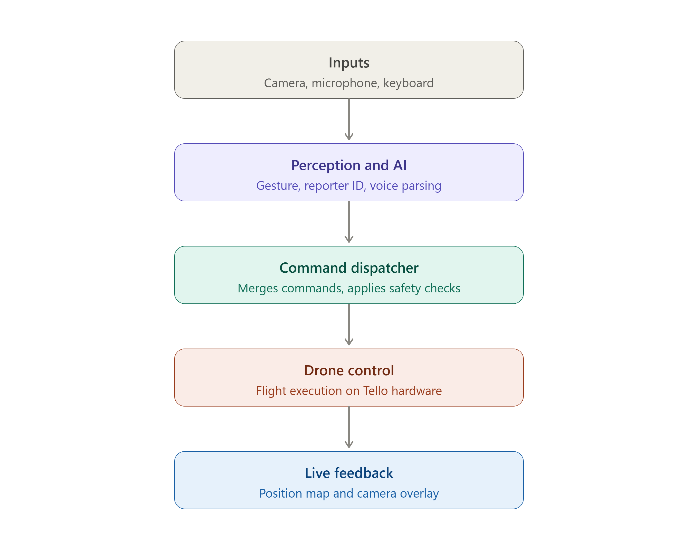
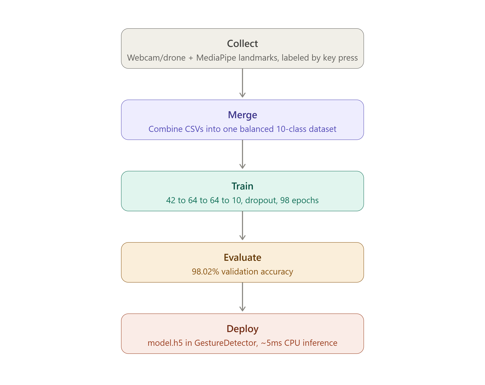
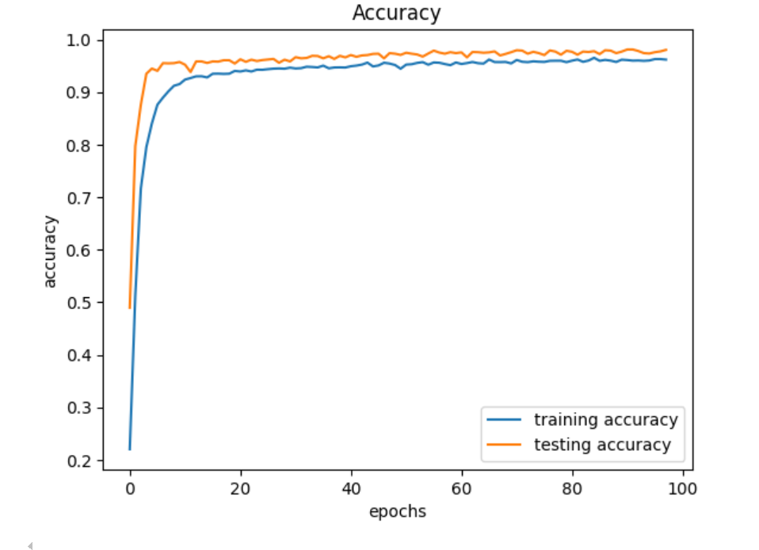
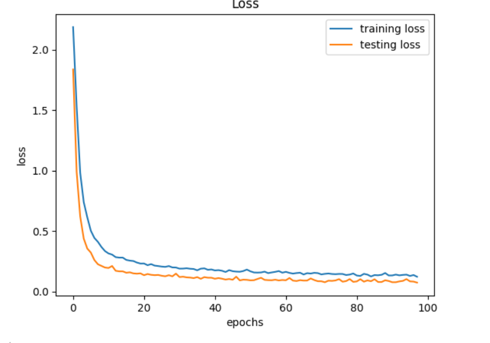

<a id="readme-top"></a>

<div align="center">

# Autonomous Journalism Drone

### Hand-Gesture Control · Reporter Tracking · Voice Commands

**An AI-powered camera drone for solo reporters. You fly it with hand gestures or your voice. It
needs no wearable sensors and no handheld controller.**

[![Python][Python-badge]][Python-url]
[![uv][uv-badge]][uv-url]
[![OpenCV][OpenCV-badge]][OpenCV-url]
[![MediaPipe][MediaPipe-badge]][MediaPipe-url]
[![TensorFlow][TensorFlow-badge]][TensorFlow-url]
[![YOLOv8][YOLO-badge]][YOLO-url]
[![DJI Tello][Tello-badge]][Tello-url]
[![License: AGPL-3.0][License-badge]][License-url]

[Getting Started](#getting-started) ·
[Usage](#usage) ·
[Architecture](#architecture) ·
[Troubleshooting](#troubleshooting)

</div>

<!-- TABLE OF CONTENTS -->
<details>
  <summary><strong>Table of Contents</strong></summary>
  <ol>
    <li>
      <a href="#about-the-project">About The Project</a>
      <ul>
        <li><a href="#the-problem">The Problem</a></li>
        <li><a href="#key-features">Key Features</a></li>
        <li><a href="#built-with">Built With</a></li>
      </ul>
    </li>
    <li><a href="#architecture">Architecture</a></li>
    <li>
      <a href="#getting-started">Getting Started</a>
      <ul>
        <li><a href="#prerequisites">Prerequisites</a></li>
        <li><a href="#installation">Installation</a></li>
        <li><a href="#api-keys">API Keys</a></li>
        <li><a href="#whisper-model">Whisper Model</a></li>
        <li><a href="#dependency-pins">Dependency Pins</a></li>
      </ul>
    </li>
    <li><a href="#testing-without-a-drone">Testing Without a Drone</a></li>
    <li>
      <a href="#usage">Usage</a>
      <ul>
        <li><a href="#flying-the-real-tello">Flying the Real Tello</a></li>
        <li><a href="#flight-controls">Flight Controls</a></li>
        <li><a href="#gesture-reference">Gesture Reference</a></li>
        <li><a href="#voice-commands">Voice Commands</a></li>
        <li><a href="#other-scripts">Other Scripts</a></li>
      </ul>
    </li>
    <li><a href="#gesture-model">Gesture Model</a></li>
    <li><a href="#project-structure">Project Structure</a></li>
    <li><a href="#troubleshooting">Troubleshooting</a></li>
    <li><a href="#author">Author</a></li>
    <li><a href="#license">License</a></li>
    <li><a href="#acknowledgments">Acknowledgments</a></li>
  </ol>
</details>

---

<!-- ABOUT THE PROJECT -->
## About The Project

### The Problem

Live journalism often needs a second person, such as a camera operator or a drone pilot, to
capture moving shots. Solo reporters and small teams usually can't have one. This project turns
a low-cost **DJI Tello** into a hands-free camera operator.

The drone uses only its onboard camera. It finds the **reporter** by detecting who is holding a
microphone. It then tracks that person and follows only their hand gestures and voice commands,
ignoring everyone else in the frame. **Anyone** can still use the safety commands (land, hover,
emergency stop) at any time.

> **Status:** Functional prototype, tested in real flights on DJI Tello hardware. It is not yet
> ready for outdoor or production use.

### Key Features

- 🎯 **Reporter guard.** YOLOv8 and ByteTrack track every person in the frame. A vision-language
  model (Gemini, Groq, or OpenRouter) finds the microphone holder, and only that person can
  control the drone.
- ✋ **Hand-gesture control.** Ten hand signs (A–J) are classified by a custom MediaPipe + Keras
  model at 30 Hz. A MediaPipe *pose gate* runs the gesture engine only while a hand is raised.
- 🎙️ **Voice commands.** Microphone → VAD → **faster-whisper** (offline) → regex/LLM intent
  parser. Say *"describe the scene"* and the drone speaks a description back using text-to-speech.
- 🙂 **Face-tracking mode.** The drone follows your face using PID control with distance
  estimation.
- 🗺️ **Dead-reckoning position map.** A live 2D map shows the estimated position and heading. A
  3-phase **return-home** (climb → fly back → descend) uses the same estimate.
- 🛡️ **Hardened safety.** Includes a battery guard and emergency landing. If an error happens
  mid-flight, the drone still lands and the video stream is turned off.

### Built With

| Area | Technology |
|---|---|
| Drone SDK | [djitellopy](https://github.com/damiafuentes/DJITelloPy) |
| Computer vision | [OpenCV](https://opencv.org/) (contrib), [MediaPipe](https://developers.google.com/mediapipe) |
| Gesture model | [TensorFlow](https://www.tensorflow.org/) / Keras, scikit-learn |
| Person tracking | [Ultralytics YOLOv8](https://docs.ultralytics.com/) + ByteTrack |
| Vision LLMs | [Google Gemini](https://ai.google.dev/), [Groq](https://groq.com/), [OpenRouter](https://openrouter.ai/) |
| Speech | [faster-whisper](https://github.com/SYSTRAN/faster-whisper), webrtcvad, sounddevice, pyttsx3 |
| UI | tkinter (tabbed window), pygame (keyboard input) |
| Packaging | [uv](https://docs.astral.sh/uv/) (`pyproject.toml` + `uv.lock`) |

<p align="right">(<a href="#readme-top">back to top</a>)</p>

---

<!-- ARCHITECTURE -->
## Architecture

The main program runs a **30 Hz flight loop**. Worker threads handle video decoding, gesture and
pose inference, reporter identification, and the voice pipeline. Their outputs go through a
single *debounce → latch → merge → dispatch* chain before any RC command reaches the drone.

| System architecture | Training pipeline |
|---|---|
|  |  |

<p align="right">(<a href="#readme-top">back to top</a>)</p>

---

<!-- GETTING STARTED -->
## Getting Started

All commands are for **PowerShell** and run from the project root.

### Prerequisites

| Requirement | Notes |
|---|---|
| Windows 10/11, 64-bit | The lockfile is resolved for `win_amd64`; tested on Windows 10 Pro 22H2 |
| [uv](https://docs.astral.sh/uv/) | Installs Python 3.10 and every dependency |
| ~10 GB free disk | ~4.5 GB of packages, up to 1.5 GB per Whisper model, plus the uv cache |
| Webcam + microphone | For the no-drone demo and voice commands |
| DJI Tello | Only needed for real flights |

> **Keep the project path short.** Windows limits paths to 260 characters, and some packages
> (sounddevice, ultralytics) have deeply nested files. A path like `D:\Projects\journalism-drone`
> is safe. A long nested path can fail with *"The filename or extension is too long"*. You can
> also enable long paths from an admin PowerShell:
> `New-ItemProperty -Path HKLM:\SYSTEM\CurrentControlSet\Control\FileSystem -Name LongPathsEnabled -Value 1 -PropertyType DWORD -Force`

### Installation

1. **Install uv.** Afterwards, close and reopen PowerShell so `uv` is on your PATH.
   ```powershell
   powershell -ExecutionPolicy ByPass -c "irm https://astral.sh/uv/install.ps1 | iex"
   ```
2. **Get the code.**
   ```powershell
   git clone https://github.com/Sheikh-Muhammad-Mujtaba/Autonomous-Drone-with-Hand-Gesture-Control.git D:\Projects\journalism-drone
   cd D:\Projects\journalism-drone
   ```
3. **Create the environment.** `uv sync` reads `.python-version` (3.10), downloads that Python if
   it's missing, creates `.venv`, and installs exactly what `uv.lock` lists.
   ```powershell
   $env:UV_LINK_MODE = "copy"   # needed when the project and the uv cache are on different drives
   uv sync
   ```
4. **Check the install.**
   ```powershell
   uv run python -c "import cv2, mediapipe, tensorflow, webrtcvad, djitellopy; from openai import OpenAI; from google import genai; print('OK', cv2.__version__, hasattr(cv2,'CascadeClassifier'), hasattr(mediapipe,'solutions'))"
   ```
   The expected output, after some TensorFlow log lines, is `OK 4.10.0 True True`.

Use `uv run <command>` to run anything in the environment. Alternatively, activate it once per
shell with `.\.venv\Scripts\Activate.ps1`, then use plain `python`. If `Activate.ps1` is
blocked, run `Set-ExecutionPolicy -Scope CurrentUser RemoteSigned` once.

### API Keys

All API keys are **optional**. Create a `.env` file in the project root. It is git-ignored, so
never commit it.

```dotenv
# Voice commands: LLM fallback for intents the regex parser doesn't catch
# Free key: https://console.groq.com/keys
GROQ_API_KEY=your_groq_key

# Reporter guard (identifies the person holding the microphone).
# Any one of these enables it; without them it turns itself off.
GEMINI_API_KEY=your_gemini_key          # https://aistudio.google.com/apikey
OPENROUTER_API_KEY=your_openrouter_key  # https://openrouter.ai/settings/keys
```

Without keys the drone **still flies**. Gestures, the pose gate, face tracking, keyboard
control, and offline speech-to-text all work, and voice commands fall back to the built-in regex
parser.

### Whisper Model

The gesture model, YOLOv8s, and the Haar cascade are included in `model/`. The Whisper weights
are **not** in the repo. They download into `model\faster-whisper-<size>\` the first time you use
voice. It's more reliable to download them in advance:

```powershell
$env:HF_HUB_DISABLE_XET = "1"   # avoids a download that can stall at 0 bytes on some networks
uv run python -c "from huggingface_hub import snapshot_download; snapshot_download('Systran/faster-whisper-small', local_dir=r'model\faster-whisper-small')"
```

Choose the size with `WHISPER_MODEL_SIZE` in [control/voice_model.py](control/voice_model.py).
These timings were measured on a laptop CPU for a 3-second voice command:

| Model | Download | Transcribe time | Recommendation |
|---|---|---|---|
| `tiny` | 75 MB | ~0.8 s | Fastest; fine for short commands |
| `small` | 460 MB | ~2.8 s | **Default** — best balance on CPU |
| `medium` | 1.5 GB | ~8 s | Too slow for live flight without a GPU |

### Dependency Pins

Dependencies are declared in [pyproject.toml](pyproject.toml) and locked in `uv.lock`. Don't
upgrade the following without re-running the tests:

| Package | Pinned | Reason |
|---|---|---|
| `numpy` | 1.26.4 | TensorFlow 2.17 and MediaPipe break on NumPy 2 |
| `opencv-contrib-python` | 4.10.0.84 | Must be the **only** OpenCV package (see below) |
| `mediapipe` | 0.10.14 | Last version with the `mp.solutions` API used here |
| `protobuf` | 4.25.9 | Required by MediaPipe 0.10.14 |
| `tensorflow` / `tensorflow-intel` | 2.17.1 | Loads `hand_gesture_model_improve.h5`. On Windows the real code is in `tensorflow-intel`, so it's declared explicitly |
| `tensorflow-io-gcs-filesystem` | 0.31.0 | Newer releases have no Windows wheels |
| `webrtcvad-wheels` | 2.0.14.post1 | Prebuilt replacement for `webrtcvad`, which fails to compile on Windows |
| `google-genai` | 2.28.0 | Provides `from google import genai`. Don't install `genai` or `google-generativeai`; they conflict with `openai` and `protobuf` |

**OpenCV conflict.** `ultralytics` and `djitellopy` request `opencv-python`. If it gets
installed, it overwrites the `cv2` module from `opencv-contrib-python` and removes
`CascadeClassifier`. `pyproject.toml` prevents this with
`[tool.uv] exclude-dependencies = ["opencv-python"]`. Add new packages with `uv add <package>`,
never with `pip install`.

<p align="right">(<a href="#readme-top">back to top</a>)</p>

---

<!-- TESTING -->
## Testing Without a Drone

### Model check

[test_script/test_models.py](test_script/test_models.py) loads every model exactly as the
flight program does, with the same modules, paths, and parameters. It never connects to a drone,
opens a window, or uses the microphone.

```powershell
uv run python test_script\test_models.py                            # all checks
uv run python test_script\test_models.py --skip-voice               # skip loading Whisper
uv run python test_script\test_models.py --video path\to\video.mp4  # also run a live YOLO demo on a video
```

Expected ending:

```text
[PASS] model files ...
[PASS] gesture engine ...
[PASS] pose gate ...
[PASS] yolo person tracking ...
[PASS] face cascade ...
[PASS] voice pipeline (whisper) ...
RESULT: all 6 checks passed
```

A scikit-learn `InconsistentVersionWarning` about `LabelEncoder` is expected and harmless.

### Full webcam demo

[test_script/demo_webcam.py](test_script/demo_webcam.py) runs the **entire production
pipeline**, with your webcam as the video source and a `FakeDrone` that records RC commands
instead of flying. It uses the same workers, the same dispatch chain, and the same tabbed window
(Drone View / Hand Crop / Position Map) as the real program, including return-home (with
simulated sensors) and face tracking.

```powershell
uv run python test_script\demo_webcam.py               # webcam index 0
uv run python test_script\demo_webcam.py --camera 1    # another camera
uv run python test_script\demo_webcam.py --with-voice  # also start the mic/Whisper voice worker
```

What to check:

1. **Pose gate.** Raise a hand. A green box should appear around it.
2. **Gestures.** Make a trained sign with the raised hand. The box label should show the gesture
   name, and the **Hand Crop** tab should show the hand landmarks.
3. **Takeoff and movement.** Press `e` (fake takeoff), then hold a gesture or use the keys. The
   **Position Map** tab should draw the path.
4. **Face tracking.** While "flying", press `f` or hold the *flip* gesture. The console should
   print `Fb … yaw …` as the drone follows your face.
5. **Voice** (with `--with-voice`). Say *"move forward"*. The console should show
   `[voice] transcript: …`, and the command should be applied.
6. Press `q` to (fake) land and quit.

<p align="right">(<a href="#readme-top">back to top</a>)</p>

---

<!-- USAGE -->
## Usage

### Flying the Real Tello

> ⚠️ For your first flights, fly **indoors in an open space** with nobody within 2 m. Keep a
> finger on `q` (land) or `x` (emergency land).

1. **Charge** the Tello battery fully and power it on.
2. **Connect your PC's Wi-Fi** to the `TELLO-XXXXXX` network. That network has no internet, so
   the cloud features (the voice LLM and the reporter guard) need a second connection, such as
   Ethernet or a USB Wi-Fi adapter. Gestures, face tracking, and offline Whisper work without
   internet.
3. **Allow Python through Windows Firewall** (Private and Public networks) when asked on the first
   run. The drone uses UDP port 8889 for commands and 11111 for video.
4. **Calibrate once per drone.** During calibration the drone takes off and flies short legs.
   ```powershell
   uv run python -m scripts.calibrate_and_map
   ```
   Copy the printed `RC_TO_CM_S` and `RC_TO_DEG_S` values into
   [control/position_tracker.py](control/position_tracker.py). They control the accuracy of the
   position map and return-home. Re-run calibration if you switch drones or the drone starts
   behaving differently.
5. **Fly.** The program connects to the Tello as soon as it starts.
   ```powershell
   uv run python main.py
   ```

### Flight Controls

| Input | Action |
|---|---|
| `e` | Take off (blocked when the battery is low) |
| Arrow keys | Move left / right / forward / back |
| `w` / `s` | Up / down |
| `a` / `d` | Yaw left / right |
| `q` | Land and quit |
| `x` | Emergency land (also stops return-home) |
| `r` | Return home (climb → fly back → descend) |
| `f` | Toggle face-tracking mode. While it's on, the drone ignores movement keys, gestures, and voice movement commands. Press `f` again to take back control |
| `o` | Toggle reporter guard (ON = only the mic holder can give commands; OFF = anyone can) |
| Close window | Land safely and exit |

Safety commands (land, hover, emergency stop) always work for anyone, whether or not the
reporter guard is on.

### Gesture Reference

Raise a hand to turn gestures on, then make one of the trained signs:

| Sign | Command | Sign | Command |
|:---:|---|:---:|---|
| **A** | Stop / land | **F** | Flip (toggles face-tracking mode) |
| **B** | Up | **G** | Turn left |
| **C** | Down | **H** | Turn right |
| **D** | Left | **I** | Move backward |
| **E** | Right | **J** | Move forward |

### Voice Commands

Voice is always on in `main.py`. Speak naturally, for example:

- *"take off"*, *"land"*, *"hover"*
- *"go up"*, *"turn left"*, *"move forward 50"*, *"move forward two meters"*
- *"describe the scene"* (the drone answers out loud)

### Other Scripts

```powershell
uv run python -m scripts.caliberation     # measure the face focal length (for face-distance estimation)
uv run python scripts\video_tracking.py   # offline reporter-ID test on a video file
```

<p align="right">(<a href="#readme-top">back to top</a>)</p>

---

<!-- GESTURE MODEL -->
## Gesture Model

The gesture classifier is a dense network trained on **MediaPipe hand landmarks**, not raw
pixels. This keeps it light enough for real-time inference on a CPU. Data collection, the training
notebook, and exported models are in
[custom_hand_gesture_model_training/](custom_hand_gesture_model_training/).

| Metric | Value |
|---|---|
| Classes | 10 (A–J) |
| Validation accuracy | **98.0 %** |
| Training accuracy | 96.2 % |

| Accuracy | Loss |
|---|---|
|  |  |

<p align="right">(<a href="#readme-top">back to top</a>)</p>

---

<!-- PROJECT STRUCTURE -->
## Project Structure

```text
.
├── main.py                 # Entry point: wiring + 30 Hz flight loop
├── config.py               # Paths and tunables (relative to the project root)
├── core/                   # Video reader, worker threads, face-tracking PID
├── perception/             # Gesture classifier, pose gate, reporter tracker, face detector
├── control/                # Command dispatcher, position tracker/map, voice pipeline
├── ui/                     # Unified tabbed window (tkinter), pygame key module
├── scripts/                # Calibration tools + offline video tracking test
├── test_script/            # No-drone tests: model check + full webcam demo
├── model/                  # Model weights (gesture .h5, yolov8s.pt, cascade, whisper)
├── custom_hand_gesture_model_training/  # Data collection, notebook, exported models
├── assets/                 # Architecture diagrams
├── custom_bytetrack.yaml   # ByteTrack tracker settings
├── pyproject.toml          # Project metadata + dependencies (uv)
├── uv.lock                 # Exact, tested dependency set
└── .python-version         # Python 3.10 (read by uv)
```

<p align="right">(<a href="#readme-top">back to top</a>)</p>

---

<!-- TROUBLESHOOTING -->
## Troubleshooting

| Symptom | Fix |
|---|---|
| `failed to hardlink files` / slow `uv sync` | `$env:UV_LINK_MODE = "copy"` |
| `cv2` has no `CascadeClassifier`, or `module 'cv2' has no attribute …` | `opencv-python` got installed outside uv. Run `uv sync` to restore the locked set |
| `mediapipe has no attribute 'solutions'` | Wrong MediaPipe version. Run `uv sync` |
| `No module named 'tensorflow.…'` on Windows | `tensorflow-intel` is missing. Run `uv sync` |
| `ResolutionImpossible` about `protobuf` / `openai` | `google-generativeai` or `genai` was added. Remove it with `uv remove`; only `google-genai` is needed |
| `The filename or extension is too long` / DLL load fails | Move the project to a shorter path or enable long paths (see [Prerequisites](#prerequisites)) |
| Whisper download stuck at 0 bytes | `$env:HF_HUB_DISABLE_XET = "1"` and try again |
| Whisper `invalid payload size` / load error | `model.bin` is truncated. Delete the `model\faster-whisper-<size>\` folder and download it again |
| `[Reporter] DISABLED: …` | Add a Gemini, Groq, or OpenRouter key to `.env`, or ignore it (the feature is optional) |
| `Could not open webcam` | Close other camera apps, or try `--camera 1` |
| Tello connects but there is no video | Allow Python through the firewall (UDP 11111) and stay close to the drone |

<p align="right">(<a href="#readme-top">back to top</a>)</p>

---

<!-- AUTHOR -->
## Author

**Sheikh Muhammad Mujtaba**

- Email: [smujtabaja@gmail.com](mailto:smujtabaja@gmail.com)
- GitHub: [@Sheikh-Muhammad-Mujtaba](https://github.com/Sheikh-Muhammad-Mujtaba)
- Project: [Autonomous-Drone-with-Hand-Gesture-Control](https://github.com/Sheikh-Muhammad-Mujtaba/Autonomous-Drone-with-Hand-Gesture-Control)

<p align="right">(<a href="#readme-top">back to top</a>)</p>

---

<!-- LICENSE -->
## License

Copyright © 2026 Sheikh Muhammad Mujtaba.

Distributed under the **GNU Affero General Public License v3.0**. See [LICENSE](LICENSE) for the
full text.

This project uses [Ultralytics YOLOv8](https://github.com/ultralytics/ultralytics) and ships its
`yolov8s.pt` weights, both licensed under AGPL-3.0, so the project uses the same license. In
short, you may use, modify, and share it. However, if you distribute it or offer it as a network
service, you must release your source code under AGPL-3.0 too.

<p align="right">(<a href="#readme-top">back to top</a>)</p>

---

<!-- ACKNOWLEDGMENTS -->
## Acknowledgments

- [DJITelloPy](https://github.com/damiafuentes/DJITelloPy): Python SDK for the DJI Tello
- [MediaPipe](https://developers.google.com/mediapipe): hand and pose landmarks
- [Ultralytics](https://github.com/ultralytics/ultralytics): YOLOv8 and ByteTrack
- [faster-whisper](https://github.com/SYSTRAN/faster-whisper): offline speech recognition

<p align="right">(<a href="#readme-top">back to top</a>)</p>

<!-- MARKDOWN LINKS & IMAGES -->
[Python-badge]: https://img.shields.io/badge/Python-3.10-3776AB?style=for-the-badge&logo=python&logoColor=white
[Python-url]: https://www.python.org/
[uv-badge]: https://img.shields.io/badge/uv-managed-DE5FE9?style=for-the-badge&logo=uv&logoColor=white
[uv-url]: https://docs.astral.sh/uv/
[OpenCV-badge]: https://img.shields.io/badge/OpenCV-4.10-5C3EE8?style=for-the-badge&logo=opencv&logoColor=white
[OpenCV-url]: https://opencv.org/
[MediaPipe-badge]: https://img.shields.io/badge/MediaPipe-0.10.14-0097A7?style=for-the-badge&logo=google&logoColor=white
[MediaPipe-url]: https://developers.google.com/mediapipe
[TensorFlow-badge]: https://img.shields.io/badge/TensorFlow-2.17-FF6F00?style=for-the-badge&logo=tensorflow&logoColor=white
[TensorFlow-url]: https://www.tensorflow.org/
[YOLO-badge]: https://img.shields.io/badge/YOLOv8-Ultralytics-111F68?style=for-the-badge
[YOLO-url]: https://docs.ultralytics.com/
[Tello-badge]: https://img.shields.io/badge/DJI-Tello-000000?style=for-the-badge&logo=dji&logoColor=white
[Tello-url]: https://www.ryzerobotics.com/tello
[License-badge]: https://img.shields.io/badge/License-AGPL--3.0-A42E2B?style=for-the-badge
[License-url]: LICENSE
